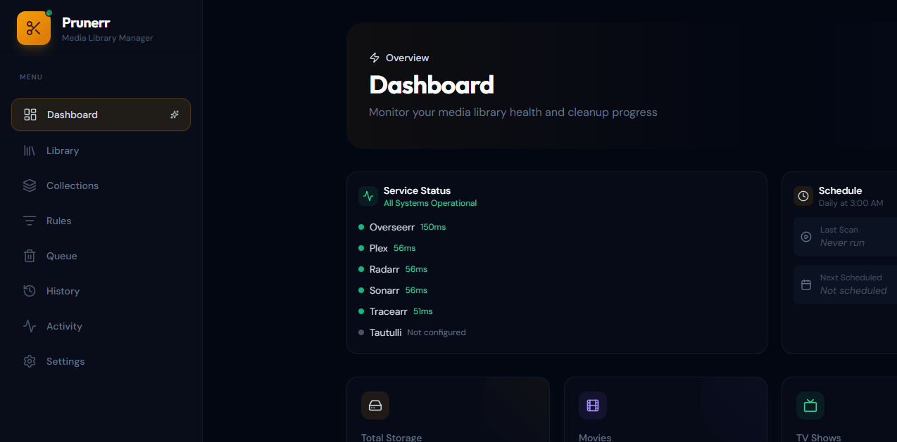

<p align="center">
  
</p>

<h1 align="center">Prunerr</h1>

<p align="center">
  <strong>Intelligent media library cleanup for Plex, Sonarr, and Radarr</strong>
</p>

<p align="center">
  <a href="https://hub.docker.com/r/helliott20/prunerr"></a>
  
  <a href="https://github.com/helliott20/prunerr/releases"></a>
  <a href="https://forums.unraid.net/topic/196929-support-prunerr-media-library-cleanup-tool/"></a>
</p>

<p align="center">
  <a href="https://github.com/helliott20/prunerr/wiki">Wiki</a> &bull;
  <a href="https://github.com/helliott20/prunerr/wiki/Installation">Install</a> &bull;
  <a href="https://github.com/helliott20/prunerr/wiki/API-Reference">API</a> &bull;
  <a href="https://forums.unraid.net/topic/196929-support-prunerr-media-library-cleanup-tool/">Unraid Forum</a>
</p>

---

If you run a Plex server, you know the pain. Your library keeps growing, nobody watches half of it, and you're constantly running out of disk space. Prunerr sits between your Plex server and your *arr apps and figures out what's worth keeping.

You set up rules like "delete movies nobody's watched in 6 months that are over 20GB" and Prunerr handles the rest. Everything goes through a deletion queue first, so nothing gets removed without you knowing about it.

<p align="center">
  
</p>

## Features

- **Rules Engine** &mdash; 28 condition fields across quality, ratings, watch history, collections, and metadata. Three ways to build rules: templates, natural language, or a full nested condition editor with live preview. [More &rarr;](https://github.com/helliott20/prunerr/wiki/Rules-Engine)

- **Collections** &mdash; Syncs movie collections from Radarr. Protect entire collections to prevent cleanup, or queue them for bulk deletion. [More &rarr;](https://github.com/helliott20/prunerr/wiki/Collections)

- **Smart Deletion** &mdash; Grace periods, four deletion actions (unmonitor, delete files, full removal, etc.), Overseerr request resets, and a review queue. Nothing gets deleted without your say-so. [More &rarr;](https://github.com/helliott20/prunerr/wiki/Deletion-Management)

- **Dashboard** &mdash; Library stats, storage trends, service health monitoring, upcoming deletions, and recommendations at a glance.

- **Per-User Watch History** &mdash; Integrates with Tautulli or Tracearr to track who watched what. Build rules around specific users' watching habits.

- **API** &mdash; Full REST API with key authentication for scripts, automation, and mobile apps like nzb360. [More &rarr;](https://github.com/helliott20/prunerr/wiki/API-Reference)

## Quick Start

```bash
docker run -d \
  --name prunerr \
  -p 3000:3000 \
  -v /path/to/data:/app/data \
  -e PLEX_URL=http://your-plex-server:32400 \
  -e PLEX_TOKEN=your-plex-token \
  -e SONARR_URL=http://your-sonarr:8989 \
  -e SONARR_API_KEY=your-sonarr-api-key \
  -e RADARR_URL=http://your-radarr:7878 \
  -e RADARR_API_KEY=your-radarr-api-key \
  helliott20/prunerr:latest
```

Also available via **Docker Compose** and the **Unraid Community Apps** store. See the [Installation guide](https://github.com/helliott20/prunerr/wiki/Installation) for full details.

## Integrations

| Service | Purpose | Required |
|---------|---------|----------|
| **Plex** | Media server &mdash; library data, watch status | Yes |
| **Sonarr** | TV show management | Recommended |
| **Radarr** | Movie management, collections | Recommended |
| **Tautulli** / **Tracearr** | Per-user watch history | One required |
| **Overseerr** / **Seerr** | Request management | Optional |
| **Unraid** | Server monitoring | Optional |
| **Discord** | Notifications | Optional |

## Mobile

Prunerr works as a custom web app in [nzb360](https://nzb360.com/) on Android, or in any mobile browser. The UI is fully responsive. See the [Mobile Access guide](https://github.com/helliott20/prunerr/wiki/Mobile-Access).

## Documentation

Full docs are in the **[Wiki](https://github.com/helliott20/prunerr/wiki)**:

- [Installation](https://github.com/helliott20/prunerr/wiki/Installation) &mdash; Docker, Compose, Unraid
- [Configuration](https://github.com/helliott20/prunerr/wiki/Configuration) &mdash; Environment variables and service connections
- [Rules Engine](https://github.com/helliott20/prunerr/wiki/Rules-Engine) &mdash; Building and managing rules
- [Collections](https://github.com/helliott20/prunerr/wiki/Collections) &mdash; Protection and bulk actions
- [Deletion Management](https://github.com/helliott20/prunerr/wiki/Deletion-Management) &mdash; Queue, grace periods, actions
- [API Reference](https://github.com/helliott20/prunerr/wiki/API-Reference) &mdash; Endpoints and authentication
- [Troubleshooting](https://github.com/helliott20/prunerr/wiki/Troubleshooting) &mdash; Common issues

## Support

- **Unraid Forum:** [Support Thread](https://forums.unraid.net/topic/196929-support-prunerr-media-library-cleanup-tool/)
- **GitHub Issues:** [Report a Bug](https://github.com/helliott20/prunerr/issues)
- **Docker Hub:** [helliott20/prunerr](https://hub.docker.com/r/helliott20/prunerr)

## License

MIT License. See [LICENSE](LICENSE).
